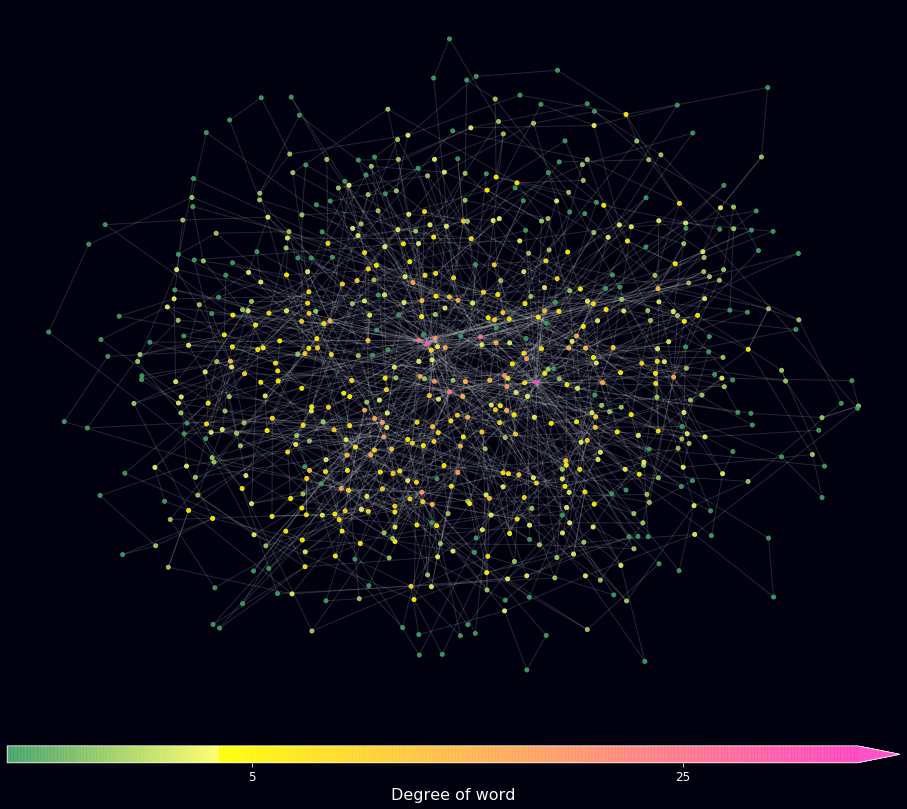
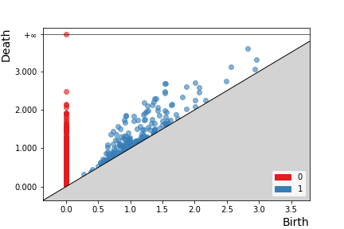
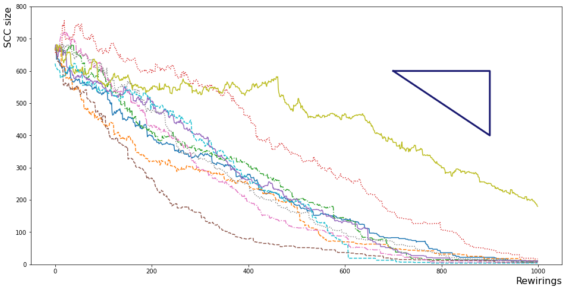

## About the project

This project was used to explore the paper 'Loops and Self-Reference in the Construction of Dictionaries' (https://journals.aps.org/prx/abstract/10.1103/PhysRevX.2.031018) in order to analyse how random language really is. We build a language network by treating relationships between dictionary entries and the words used to define that definition being reminiscent of an edge forming between two nodes on a graph. Topological Data Analysis is used on a network graph to understand its structure, followed by MCMC double edge-swap rewiring.

This project was done as part of the Applied Data Science profile offered by Utrecht University, Netherlands, under the supervision of Ivan Kryven.

<p align="right">(<a href="#top">back to top</a>)</p>


## Prerequisites

In python:
* networkx
  ```sh
  pip install networkx==2.6.2
  ```
* matplotlib
  ```sh
  pip install matplotlib==2.2.3
  ```
* gudhi
  ```sh
  pip install gudhi
  ```
  
  Using other versions will not render graph construction due to node, edge attributes. To run the examples, jupyter is required.

<p align="right">(<a href="#top">back to top</a>)</p>


## Usage

### 1) Build a language network graph from a dictionary and extract its giant strongly connected component (SCC).




Example of other SCC includes:

SCC 1 | SCC 2 | SCC 3
------------ | -------------
communication | philippines | germanium
message | tagalong | silicon
information | philippine | semiconductor
 | luzon | argyrodite


### 2) Perform TDA and assess persistence on language network.




### 3) Rewire graph using MCMC principles and simulated annealing techniques for optimisation of network in terms of SCC size.




<p align="right">(<a href="#top">back to top</a>)</p>


## Contact

David Vikhansky - davidvikh@yahoo.co.uk


<p align="right">(<a href="#top">back to top</a>)</p>
